I'm a Junior Full-Stack Web Developer and a graduate of the Rekayasa Perangkat Lunak (RPL) program, focused on building responsive, efficient, and user-friendly web applications.

I primarily work with Laravel, Next.js, JavaScript, and MySQL, turning operational needs into practical digital solutions. My projects include production order management systems, online admission platforms, and smart attendance systems with QR codes, facial recognition, and location verification.

I’m particularly interested in backend development, database design, business process digitalization, and building reliable systems that are easy to use and maintain.

I enjoy learning new technologies, solving problems, and creating useful software that brings real value to people and organizations.

  
  
  
  
  
  

## Technologies & Tools 
           

## GitHub Statistics

---

## Contribution Activity

---

## GitHub Streak

---

